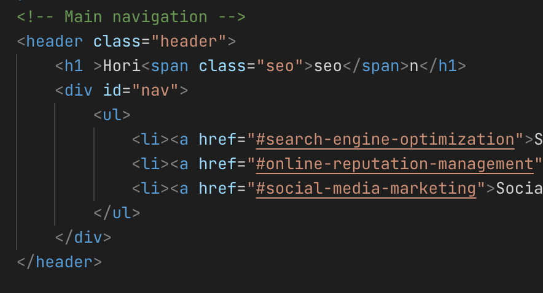
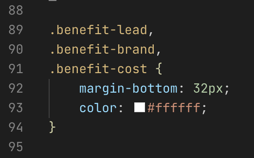

# Code Refactor

<<<<<<< HEAD
This project's focus is on a refactor of the entire HTML and CSS pages and clean up the following things:
=======
Went through the entire page and cleaned up a couple things under the hood:
>>>>>>> c159d32cf5d3d32cb41d890091c82640747c4c57

<ul>
<li>Fix of the "Search Engine Optimization" link not working</li>

<li>Alt text for images</li>

<<<<<<< HEAD
<li>HTML semantics tags</li>

<li>Consolidate CSS tags</li>

<li>Deployed onto GitHub and made live through pages</li>

<li>Add appropriate comments for each section</li>
=======
<li>Added HTML semantics to the page</li>

<li>Cleaned combined some redundent CSS tags</li>
>>>>>>> c159d32cf5d3d32cb41d890091c82640747c4c57
</ul>
 

## Examples of changes
 

Example of a header tag being used instead of a div tag. This helps the HTML semantics and google search algorithm.
Also a comment to describe what the block of code represents.

Here's a good example, before each of these styles had their own individual styles instances and they all shared the same goal. Here I simply consolidated them into one style.

 
### Check it out for yourself!

https://kh288.github.io/Code-Refactor/